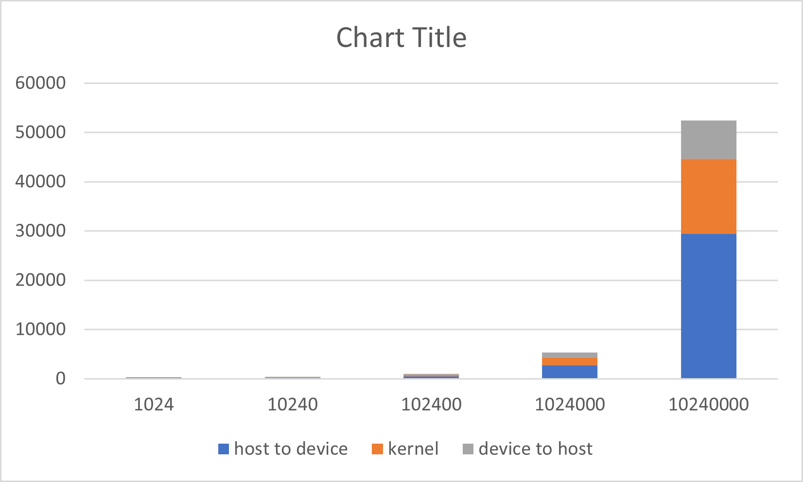
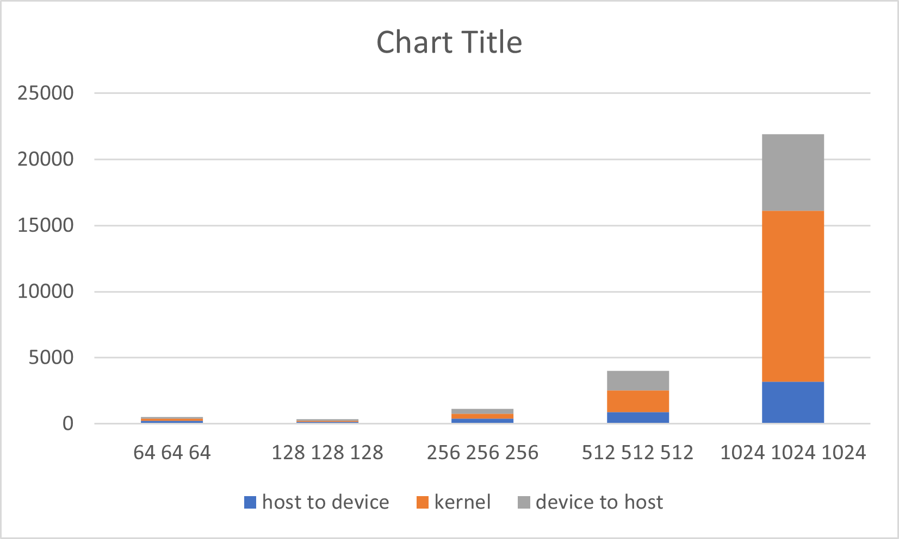
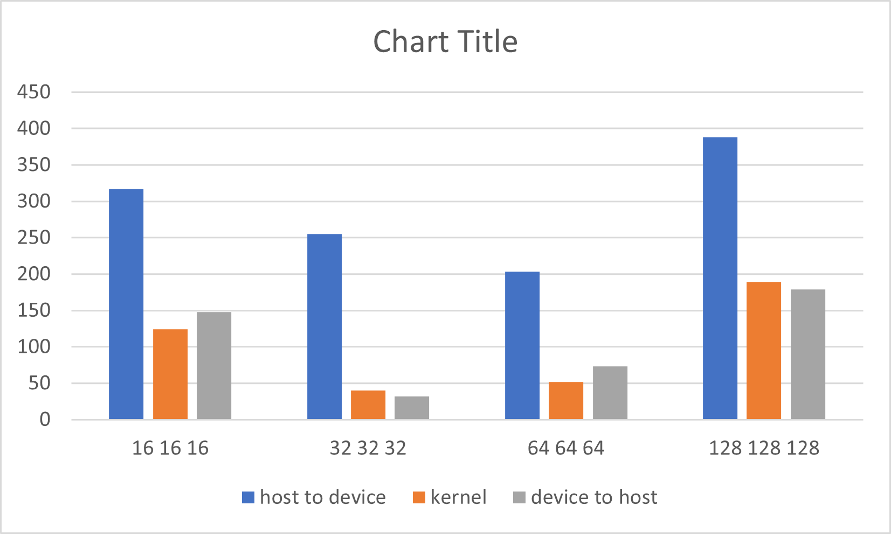

# Assignment II: CUDA Basics I

<https://github.com/ysiad2001/DD2360HT23/tree/master/hw_2>

## Exercise 1 First CUDA program and GPU performance metrics

The program is compiled and run by

```
nvcc ex1.cu -o ex1
./ex1
```

For a vector length of N, there will be ``1`` floating operations performed in each vector add kernel.

For every kernel, there will be ``2`` memory read from the host. To be more exact, the data are copied from the host to the device, and being read at the device.

In my implementation, for a vector length of ``1024``, there is ``4`` block with ``256`` threads used. These can be configured by changing the macro.

After profiling the program with Nvidia Nsight by inputting
```
/usr/local/cuda-11/bin/nv-nsight-cu-cli ./ex1 1024
```
We see the achieved occupancy is 23.87\%.


After increasing the vector length to 131070, the program still works.
```
./ex1 131070
The input length is 131070
Duration is 379
```

There will be ``inputSize/THREAD_PER_BLOCK+1`` threads.

Now the achieved occupancy is 24.97\%.

We tried data size from 1024 to 10240000, yielding the graph as follows



## Exercise 2 - 2D Dense Matrix Multiplication

Some application of matrix multiplication include neural network, solution of linear system, and coordinate transformation.

There are ``numAColumns`` number of floating point multiplications in a kernel.

There are ``numAColumns * 3`` global memory reads in each kernel. 

For a matrix A of (128x128) and B of (128x128), there are 16 block and 1024 threads in each block used. The achieved occupancy is  99.60\%.
 
For a matrix A of (511x1023) and B of (1023x4094), it still work.

There are ``((numCColumns + NUM_THREAD_X - 1) / NUM_THREAD_X)*((numCRows + NUM_THREAD_Y - 1) / NUM_THREAD_Y)`` blocks used, with ``NUM_THREAD_X*NUM_THREAD_Y`` threads for each block.

The achieved occupancy is  99.76\%.
 
Further increasing the size of matrix A and B, the plot for double data type is

It looks like when the matrix size is large, the time spent tends to be polynomialy progressing. At smaller matrix sizes, the time spent varies. Also, memory copy takes much time.

The plot for float data type is

The float type takes much more time than double. Also, when the matrix size is given as 256, calculation error occurs.
