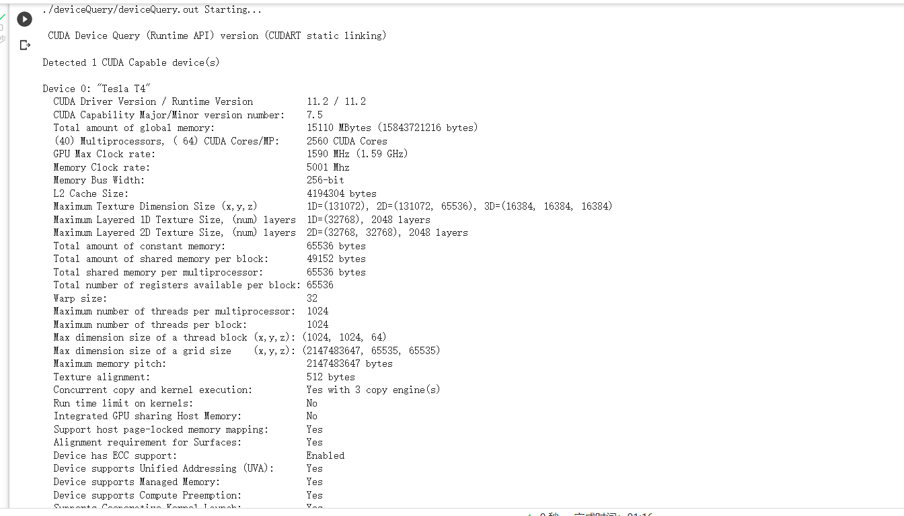

# Assignment II: GPU architecture
## Exercise 1 Reflection on GPU-accelerated Computing
### Exercise 1-1 Difference between CPU and GPU architecture
GPU is throughput-oriented architecture while CPU is latency-oriented architecture. CPU architecture will adopt design choices like memory caches, out-of-order execution, speculative execution and pipelining. While GPU adopt design choices like having many simple processing units, hardware threads and SIMD execution.
### Exercise 1-2 List of Supercomputer and GPU usage
[Reference from top500](https://www.top500.org/lists/top500/2022/11/)
|Rank|Name|core|GPU model|
|:--:|:--:|:--:|:--:|
|1|Frontier|	36,992 × 220| AMD Instinct MI250X|
|2|Fugaku|	0||
|3|LUMI|	9,408 × 220| AMD Instinct MI250X|
|4|Leonardo|	13,824 × 108| Nvidia Ampere A100|
|5|Summit|	27,648 × 80| Nvidia Tesla V100|
|6|Sierra|	17,280 × 80| Nvidia Tesla V100|
|7|Sunway TaihuLight|	0||
|8|Perlmutter|	? × 108| Nvidia Ampere A100|
|9|Selene|	4,480 × 108| Nvidia Ampere A100|
|10|Tianhe-2A|	35,584 × |Matrix-2000 128-core|
	
### Exercise 1-3 GPU power efficiency

|Rank|	System	Cores	|Rmax (PFlop/s)		|Power (kW)	| Power efficiency Rmax/Power(PFlop/s/kW)|
|:--:|:--:|:--:|:--:|:--:|
|1|	Frontier |	1,102.00|		21,100|	0.052227488|
|2|	Fugaku|	442.01	|	29,899	|0.014783438|
|3|	LUMI |309.1	|	6,016	|0.051379654|
|4|	Leonardo |	174.7	|	5,610	|0.03114082|
|5|	Summit |148.6	|	10,096|	0.0147187|
|6|	Sierra |	94.64	|	7,438|	0.01272385|
|7|	Sunway TaihuLight |	93.01|		15,371	|0.006051005|
|8|	Perlmutter|70.87	|	2,589|	0.027373503|
|9|	Selene |	63.46	|	2,646	|0.023983371|
|10|	Tianhe-2A |	61.44	|	18,482|	0.003324316

## Exercise 2 Device Query

### Exercise 2-1 deviceQuery screenshot


```

!./deviceQuery/deviceQuery.out
./deviceQuery/deviceQuery.out Starting...

 CUDA Device Query (Runtime API) version (CUDART static linking)

Detected 1 CUDA Capable device(s)

Device 0: "Tesla T4"
  CUDA Driver Version / Runtime Version          11.2 / 11.2
  CUDA Capability Major/Minor version number:    7.5
  Total amount of global memory:                 15110 MBytes (15843721216 bytes)
  (40) Multiprocessors, ( 64) CUDA Cores/MP:     2560 CUDA Cores
  GPU Max Clock rate:                            1590 MHz (1.59 GHz)
  Memory Clock rate:                             5001 Mhz
  Memory Bus Width:                              256-bit
  L2 Cache Size:                                 4194304 bytes
  Maximum Texture Dimension Size (x,y,z)         1D=(131072), 2D=(131072, 65536), 3D=(16384, 16384, 16384)
  Maximum Layered 1D Texture Size, (num) layers  1D=(32768), 2048 layers
  Maximum Layered 2D Texture Size, (num) layers  2D=(32768, 32768), 2048 layers
  Total amount of constant memory:               65536 bytes
  Total amount of shared memory per block:       49152 bytes
  Total shared memory per multiprocessor:        65536 bytes
  Total number of registers available per block: 65536
  Warp size:                                     32
  Maximum number of threads per multiprocessor:  1024
  Maximum number of threads per block:           1024
  Max dimension size of a thread block (x,y,z): (1024, 1024, 64)
  Max dimension size of a grid size    (x,y,z): (2147483647, 65535, 65535)
  Maximum memory pitch:                          2147483647 bytes
  Texture alignment:                             512 bytes
  Concurrent copy and kernel execution:          Yes with 3 copy engine(s)
  Run time limit on kernels:                     No
  Integrated GPU sharing Host Memory:            No
  Support host page-locked memory mapping:       Yes
  Alignment requirement for Surfaces:            Yes
  Device has ECC support:                        Enabled
  Device supports Unified Addressing (UVA):      Yes
  Device supports Managed Memory:                Yes
  Device supports Compute Preemption:            Yes
  Supports Cooperative Kernel Launch:            Yes
  Supports MultiDevice Co-op Kernel Launch:      Yes
  Device PCI Domain ID / Bus ID / location ID:   0 / 0 / 4
  Compute Mode:
     < Default (multiple host threads can use ::cudaSetDevice() with device simultaneously) >

deviceQuery, CUDA Driver = CUDART, CUDA Driver Version = 11.2, CUDA Runtime Version = 11.2, NumDevs = 1
Result = PASS
```

### Exercise 2-2 Specifications critical for performance

I believe the parameters critical for GPU performance is:
```
(40) Multiprocessors, ( 64) CUDA Cores/MP:     2560 CUDA Cores
GPU Max Clock rate:                            1590 MHz (1.59 GHz)
Memory Clock rate:                             5001 Mhz
Memory Bus Width:                              256-bit
L2 Cache Size:                                 4194304 bytes
```

The number of multiprocessors determine how much parallelism can be achieved. The clock rate determines how fast the computation runs, the cache size determines how fast memory access can be.

### Exercise 2-3 Calculate GPU bandwidth

The bandwidth is proportional to clock rate multiplied by memory band width. It is possible to calculate the GPU bandwidth in this way. [Reference from nvidia](https://developer.nvidia.com/blog/how-query-device-properties-and-handle-errors-cuda-cc/)
```C++
cudaDeviceProp prop;
cudaGetDeviceProperties(&prop, i);
printf("  Memory Clock Rate (KHz): %d\n",
        prop.memoryClockRate);
printf("  Memory Bus Width (bits): %d\n",
        prop.memoryBusWidth);
printf("  Peak Memory Bandwidth (GB/s): %f\n\n",
        2.0*prop.memoryClockRate*(prop.memoryBusWidth/8)/1.0e6);
```

### Exercise 2-4 

The published bandwidth is 320GB/s, the calculated is 320.064GB/s. They are consistent

## Exercise 3 Compare GPU Architecture

### Exercise 3-1 Comparison in architecture

|Specs|Hopper H100|Ampere A100 80GB​|Volta V100 32GB|
|:--:|:--:|:--:|:--:|
L2 Cache Size|51200 KB|40960 KB|6144 KB|
FP32 CUDA Cores|16896|6912|5120|
Memory Bandwidth|3072GB/sec|2039GB/sec|900GB/sec|
|Memory Clock|4.8Gbit/s HBM3|3.2Gbit/s HBM2|1.75Gbit/s HBM2|
|VRAM|80GB|80GB|32GB|

[Reference from Wikipedia](https://en.wikipedia.org/wiki/Ampere_(microarchitecture))

### Exercise 3-2 Comparison in number of SMs
|Specs|Hopper H100|Ampere A100 80GB​|Volta V100 32GB|
|:--:|:--:|:--:|:--:|
Number of SM|144|128|80|
Core per SM|117|54|64|
|Memory Clock|0.6GB/s HBM3|0.4GB/s HBM2|0.24GB/s HBM2|
Memory Bandwidth|3072GB/sec|2039GB/sec|900GB/sec|

### Exercise 3-3 Comparison to Tesla T4
The memory bandwidth is significantly increased.

## Exercise 4 - Rodinia CUDA benchmarks and Profiling

### Exercise 4-1 Implementation Detail

I have downloaded the Rodinia into my local environment, In Makefiles related to cuda, I changed ``CC:=...`` to ``CC := nvcc`` because it would not recognize nvcc otherwise. 

In the code, I had to remove ``graph1MW_6.txt`` from the Rodinia code because it causes problem on KTH github.

### Exercise 4-2 Comparison of Execution time

I did a bash script named ex4.sh. Running the script will give the 6 lines at the end:

```
openmp bfs 1.580690722
openmp hotspot .997167779
openmp lud 4.376155261
cuda bfs 2.008683375
cuda hotspot .573040435
cuda lud .893167798
```

### Exercise 4-3 Evaluation

The result showed that GPU can be better than CPU at some calculation but not some others. It may also be the case that the input size is not large enough to make the parallelism start to take advantage.