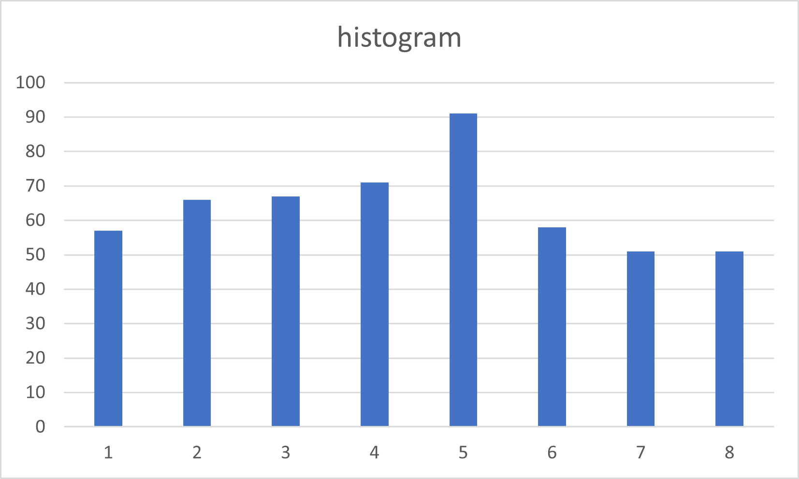
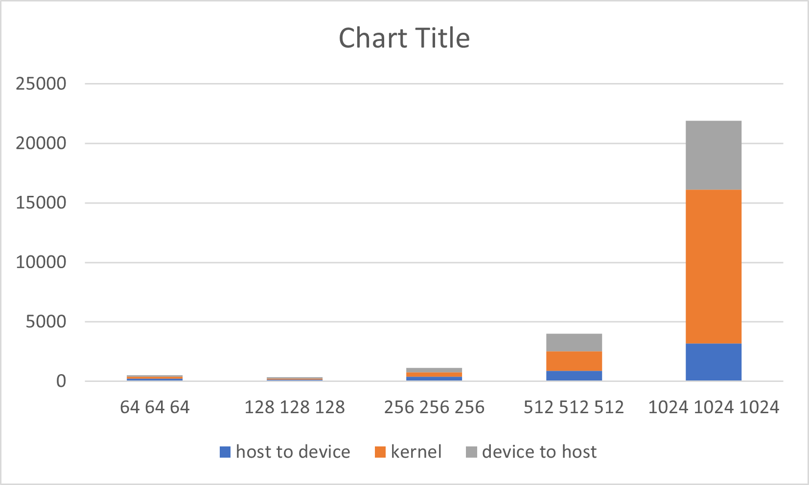
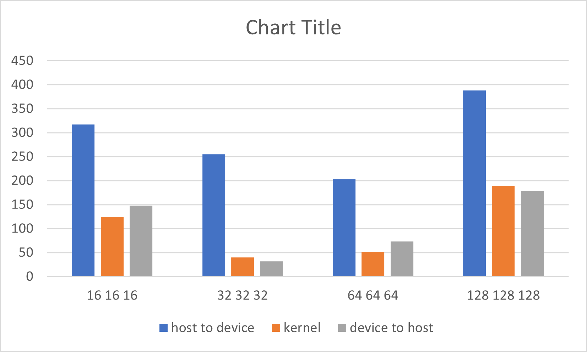

# Assignment III: CUDA Basics
## Exercise 1 First CUDA program and GPU performance metrics

The program is compiled and run by

```
nvcc ex1.cu -o ex1
./ex1
```

For a vector length of N, there will be ``N/NUM_THREAD`` floating operations performed in each vector add kernel.

There do not seem to be any global memory read, as there is not even global variable used in this program.

For a vector length of 1024, there is 1 block with 256 threads used. These can be configured by changing the macro.

After profiling the program with Nvidia Nsight by inputting
```
!/usr/local/cuda-11/bin/nv-nsight-cu-cli ./ex1 1024
```
We see the achieved occupancy is 23.87\%.


After increasing the vector length to 131070, the program still works.
```
./ex1 131070
The input length is 131070
Duration is 379
```

The CUDA threads and blocks are stillthe same as the previous part.

Now the achieved occupancy is 24.97\%.

We tried data size from 1024 to 10240000, yielding the graph as follows



## Exercise 2 - 2D Dense Matrix Multiplication

Some application of matrix multiplication include neural network, solution of linear system, and coordinate transformation.

There are ``numAColumns`` number of floating point multiplications in a kernel.

Again, there do not seem to be any global memory read, as there is not even global variable used in this program.

For a matrix A of (128x128) and B of (128x128), there are 1 block and 32 threads used. The achieved occupancy is  99.60\%.
 
For a matrix A of (511x1023) and B of (1023x4094), it still work.

There are ``((numCColumns + NUM_THREAD_X - 1) / NUM_THREAD_X)*((numCRows + NUM_THREAD_Y - 1) / NUM_THREAD_Y)`` blocks used, with ``NUM_THREAD_X*NUM_THREAD_Y`` threads for each block.

The achieved occupancy is  99.76\%.
 
Further increase the size of matrix A and B, plot a stacked bar chart showing the breakdown of time including (1) data copy from host to device (2) the CUDA kernel (3) data copy from device to host. For this, you will need to add simple CPU timers to your code regions. Explain what you observe.
Now, change DataType from double to float, re-plot the a stacked bar chart showing the time breakdown. Explain what you observe. 

The plot for double data type is

It looks like when the matrix size is large, the time spent tends to be polynomialy progressing. At smaller matrix sizes, the time spent varies. Also, memory copy takes much time.

The plot for float data type is

The float type takes much more time than double. Also, when the matrix size is given as 256, calculation error occurs.

## Exercise 3 - Histogram and Atomics

It is not clear what it means by "histogram" from the exercise specification.

## Exercise 4 - A Particle Simulation Application

It is also not clear what it means by "Particle Simulation" from the exercise specification.

I would wish that the either these contents are covered in lectures, or at least some references are given for the exercise.
