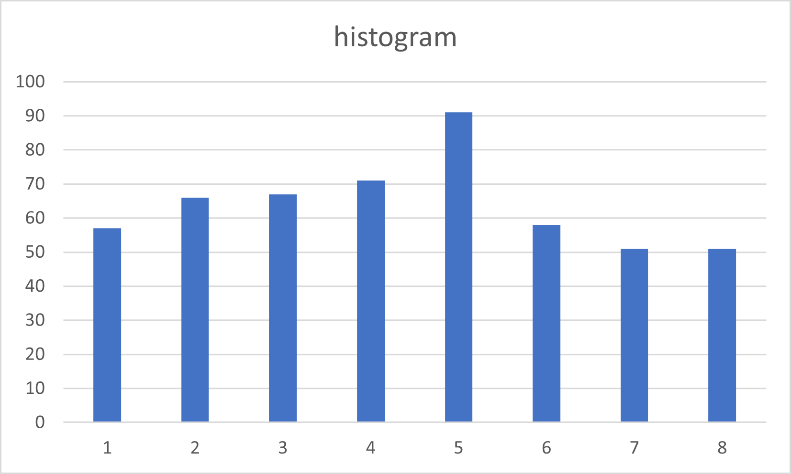

# Assignment III: CUDA Basics II

## Exercise 1 - Histogram and Atomics

Describe all optimizations you tried regardless of whether you committed to them or abandoned them and whether they improved or hurt performance. 

The parallel histograming is achieved by having a copy of an input array in all kernels ``histogram_kernel``, each kernel takes the indexes corresponding to its thread ID. Whenever an element is found on the array, ``atomicAdd()`` is called to count the index. After all the counting procedure has stopped, another kernel ``convert_kernel`` is called to make all entries greater than 127 be 127. The major optimization is to parallelize the histogramming process into 1024 parallel threads.

Each thread will handle ``num_elements/NUM_THREADS_PER_BLOCK`` array indexes, each index reference will result in a call to ``*input`` and a call to ``*bin``. So there are ``2*num_elements/NUM_THREADS_PER_BLOCK`` global memory reads.

Each thread will handle ``num_elements/NUM_THREADS_PER_BLOCK`` atomic operations for histogramming, and ``NUM_BINS NUM_THREADS_PER_BLOCK`` for adding shared memory to global memory.

The only shared memory is ``__shared__ unsigned int shared_bins[NUM_BINS]``

If a lot of array indexes are at the same value, then it is likely that more threads will try to access the same index of the ``shared_bin``, thus creating contention.

The input length 512, 8 bins



**For a input array of 1024 elements, profile with Nvidia Nsight and report Shared Memory Configuration Size and Achieved Occupancy. Did Nvsight report any potential performance issues?**

## Exercise 2 - A Particle Simulation Application

Describe the environment you used, what changes you made to the Makefile, and how you ran the simulation.

I compiled and executed the code on my local PC, made no change to the Makefile.

```bash
cd ./sputniPIC
mkdir data
make
./bin/sputniPIC.out ./inputfiles/GEM_2D.inp 
```

In mover_PC_gpu(), the functionality can be parallelized by having ``part->nop`` threads and simulating one particle on one kernel each time.

The execution time of CPU implementation is
```
   Tot. Simulation Time (s) = 46.2174
   Mover Time / Cycle   (s) = 1.73421
   Interp. Time / Cycle (s) = 2.74868
```

The execution time of GPU implementation is
```
    Tot. Simulation Time (s) = 30.9217
   Mover Time / Cycle   (s) = 0.192811
   Interp. Time / Cycle (s) = 2.75575
```