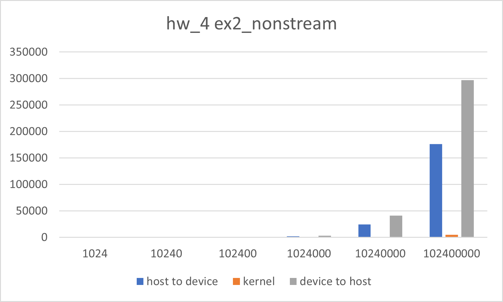
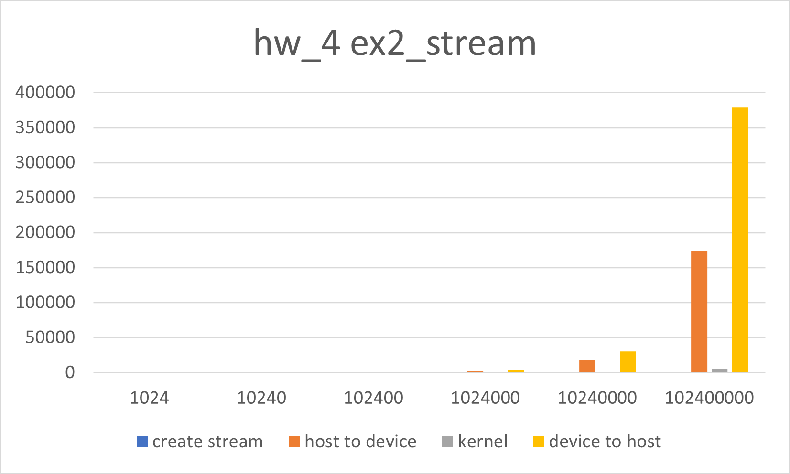
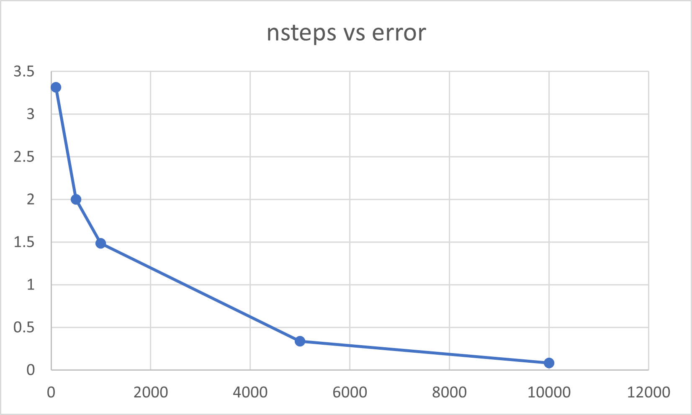
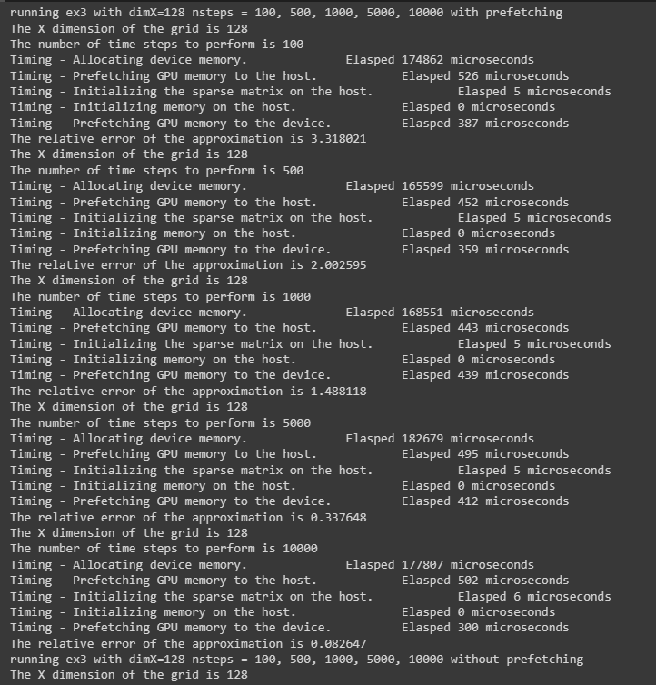
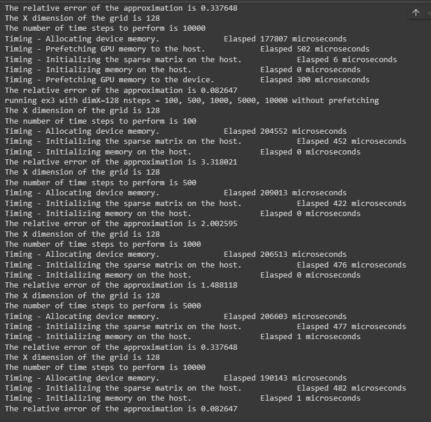

# Assignment IV: Advanced CUDA

<https://github.com/ysiad2001/DD2360HT23/tree/master/hw_4>

## Exercise 1 - Thread Scheduling and Execution Efficiency 

### X=800 Y=600 16X16 grid

The program should generate ``ceil(800/16)*ceil(600/16)=1900`` blocks. Each block has ``16*16`` threads with size ``32`` warps. In total ``1900*16*16/32=15200`` warps.

The blocks with block index ``(x,y)`` should handle threads with ``threadIdx.x`` range from  ``16*x`` to ``16*x+15`` ``threadIdx.y`` range from ``16*y`` to ``16*y+15``. The only blocks that have threads out of range are those with ``blockIdx.y==ceil(600/16)-1``. All of these blocks have 128 threads out of range and another 128 in range. Since they are in y-major alignment, each of these blocks will have ``128/32=4`` warps following the ``if`` statement and the other ``128/32=4`` follow the ``else`` statement. None of the warps have control divergence.

### X=600 Y=800 16X16 grid

In this case, blocks with ``blockIdx.x==ceil(600/16)-1`` will have control divergence in all warps. In total ``ceil(800/16)=50`` blocks with ``50*16*16/32=400`` warps.

### X=600 Y=799 16X16 grid

The situation is similar to the last question, blocks with ``blockIdx.x==ceil(600/16)-1`` will have control divergence in all warps. In total ``ceil(800/16)=50`` blocks with ``50*16*16/32=400`` warps.

## Exercise 2 - CUDA Streams

### Compare to the non-streamed vector addition

Performance of nonstream vector addition with input ranging 1024 to 102400000. The horizontal axis represent input size and vertical axis represent time in ms.



Performance of streaming vector addition with input ranging 1024 to 102400000 and 4 streams. The horizontal axis represent input size and vertical axis represent time in ms.



### Profiling

```
nvprof --output-profile ex2_stream_profile.nvprof ./ex2_stream 102400000 4
```

This command generates an output profile ``ex2_stream_profile.nvprof``.

### Impact of segment size on performance

Performance of streaming vector addition with input 10240000 and 4 to 8 streams. The horizontal axis represent segment size and vertical axis represent time in ms.


## Exercise 3 - Heat Equation with using NVIDIA libraries

### Approximate the FLOPS according to different dimX

According to this algorithm
```
for i from 1 to nsteps:
   tmp = A * temp
   temp = alpha * tmp + temp 
   norm = vectorNorm(tmp) 
   if tmp < 1e-4 : 
      break
end
```

The sparse matrix-vector multiplication typically include ``2*nzv = 6*dimX-12`` FLOPs.

AXPY operation requires ``2*dimX`` FLOPs.

Vector Norm Calculation requires ``2*dimX`` FLOPs for the squaring and summing.

In total there are ``10*dimX-12`` FLOPS per nstep.

Apparantly more input size will cause the FLOP rate to approach the peak. But it is unrealistic to reach the peak, since the device may have some resources assigned to other tasks.

### Run the program with dimX=128 and vary nsteps from 100 to 10000

It appears that the more nsteps, the less error the program produces,




### Compare the performance with and without the prefetching in Unified Memory

Performance with prefetching



Performance without prefetching



With prefetching in Unified Memory, it is in theory faster to initialize data on the device, so it should be faster.